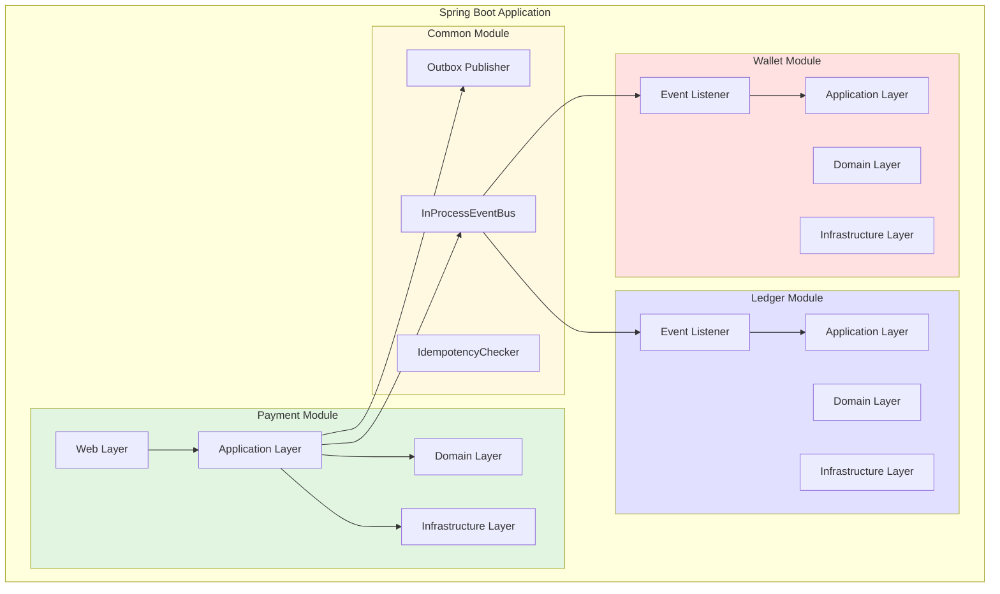
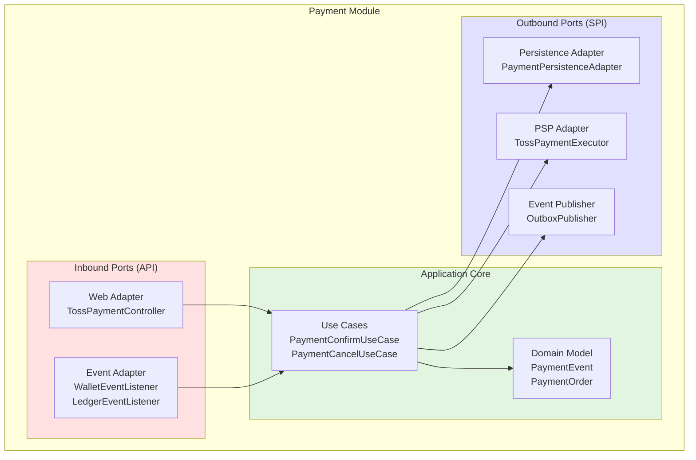
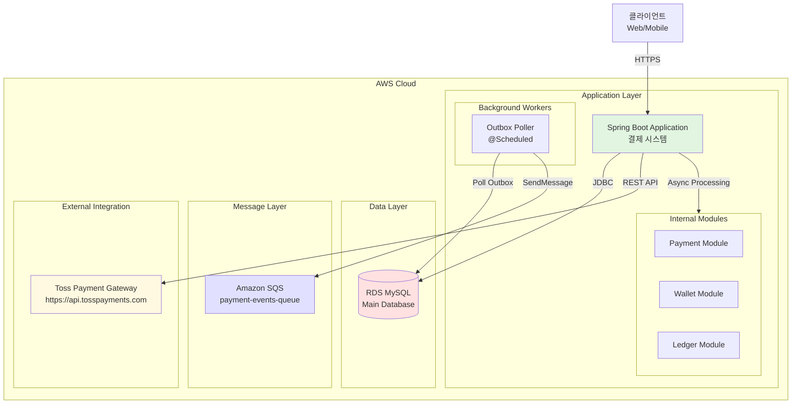
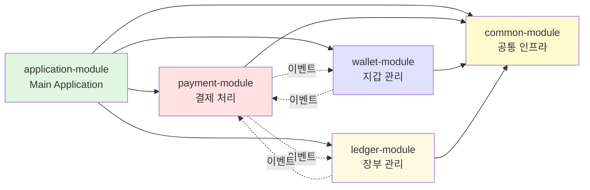
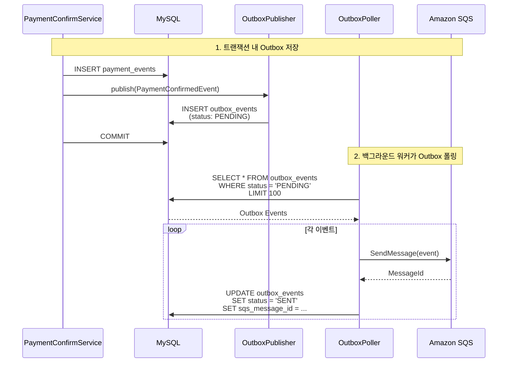
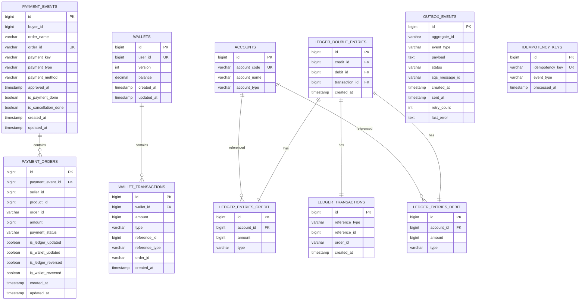
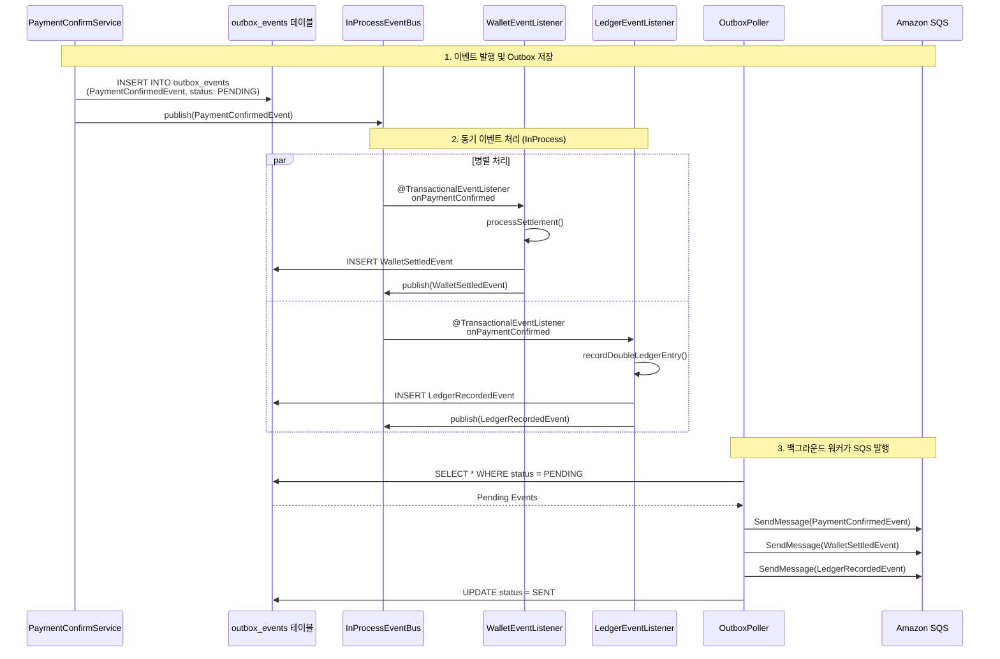
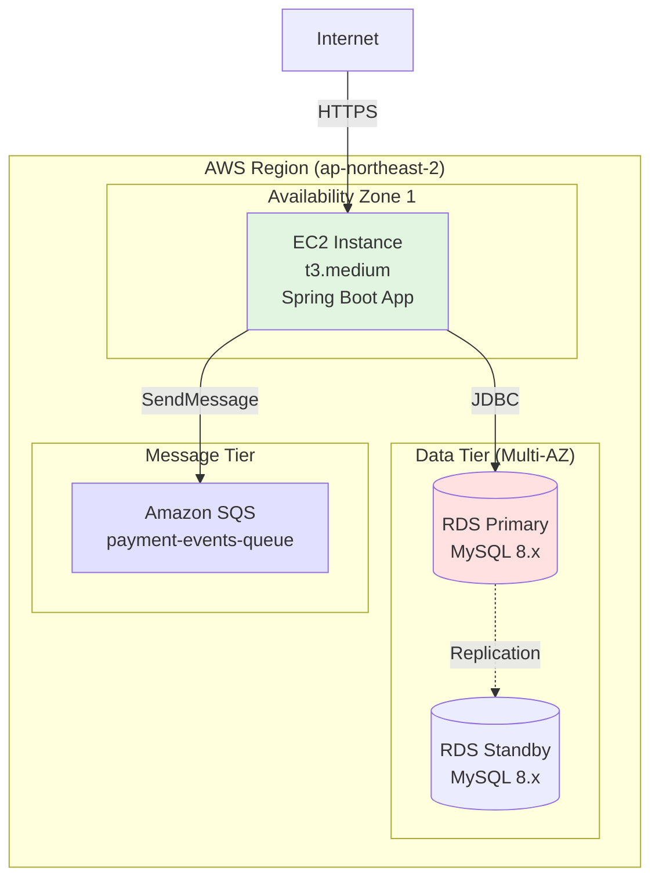
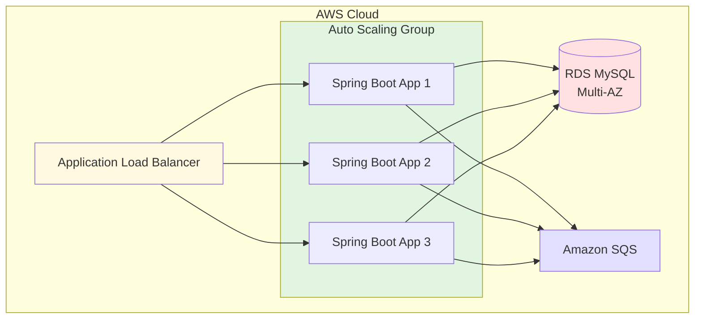
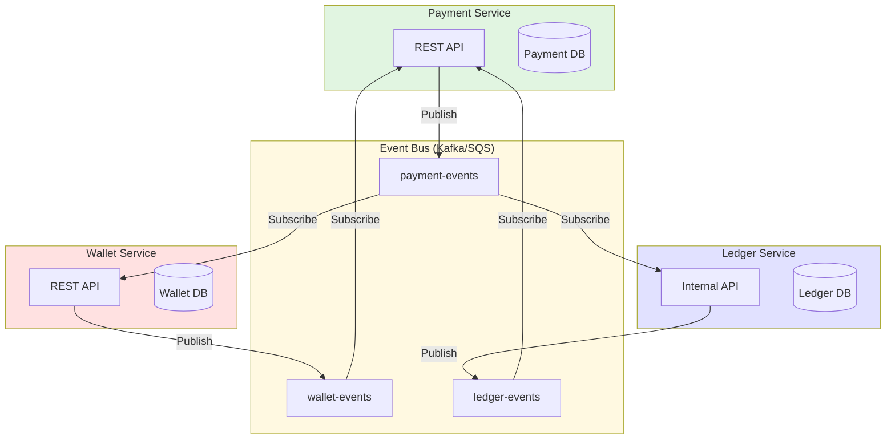

# 결제 시스템 아키텍처 문서

## 목차
1. [시스템 개요](#1-시스템-개요)
2. [아키텍처 스타일](#2-아키텍처-스타일)
3. [전체 시스템 아키텍처](#3-전체-시스템-아키텍처)
4. [모듈 구조](#4-모듈-구조)
5. [인프라 컴포넌트](#5-인프라-컴포넌트)
6. [데이터베이스 스키마](#6-데이터베이스-스키마)
7. [메시지 플로우](#7-메시지-플로우)
8. [배포 아키텍처](#8-배포-아키텍처)

---

## 1. 시스템 개요

### 1.1 시스템 목적
이 시스템은 멀티 벤더(Multi-Vendor) 전자상거래 플랫폼을 위한 결제 처리 시스템입니다. 한 명의 구매자가 여러 판매자의 상품을 동시에 구매할 수 있으며, 각 판매자에게 정산이 이루어지고 복식 부기로 장부에 기록됩니다.

### 1.2 핵심 기능
- **결제 승인**: Toss Payment Gateway를 통한 결제 처리
- **정산**: 판매자별 지갑에 자동 정산
- **장부 기록**: 복식 부기 원칙에 따른 회계 처리
- **결제 취소**: 전체 프로세스 역처리 (환불 + 역분개)
- **데이터 일관성**: Outbox 패턴과 이벤트 기반 아키텍처

### 1.3 핵심 특징
- **모놀리식 아키텍처**: 단일 애플리케이션으로 배포, 운영 복잡도 최소화
- **모듈러 모놀리스**: 패키지 수준의 모듈 경계로 명확한 분리
- **이벤트 기반**: 모듈 간 느슨한 결합, 비동기 처리
- **최종 일관성**: Saga 패턴을 통한 분산 트랜잭션 관리
- **확장 가능**: 필요 시 마이크로서비스로 분리 가능한 구조

---

## 2. 아키텍처 스타일

### 2.1 모듈러 모놀리스 (Modular Monolith)



### 2.2 헥사고날 아키텍처 (Ports & Adapters)

각 모듈은 헥사고날 아키텍처를 따릅니다:



#### 레이어 구조

```
payment-module/
├── adapter/
│   ├── in/
│   │   ├── web/              # REST API 진입점
│   │   │   └── TossPaymentController
│   │   └── event/            # 이벤트 리스너
│   │       ├── WalletEventListener
│   │       └── LedgerEventListener
│   └── out/
│       ├── persistence/      # DB 저장소
│       │   └── PaymentPersistenceAdapter
│       └── web/              # 외부 API 호출
│           └── toss/
│               └── TossPaymentExecutor
├── application/
│   ├── port/
│   │   ├── in/               # Use Case 인터페이스
│   │   │   ├── PaymentConfirmUseCase
│   │   │   └── PaymentCancelUseCase
│   │   └── out/              # 외부 의존성 인터페이스
│   │       ├── LoadPaymentPort
│   │       ├── SavePaymentPort
│   │       └── PaymentExecutorPort
│   └── service/              # Use Case 구현
│       ├── PaymentConfirmService
│       └── PaymentCancelService
└── domain/
    ├── PaymentEvent.kt       # 애그리게이트 루트
    ├── PaymentOrder.kt
    ├── PaymentStatus.kt
    └── event/
        ├── PaymentConfirmedEvent.kt
        └── PaymentCanceledEvent.kt
```

---

## 3. 전체 시스템 아키텍처

### 3.1 인프라 컴포넌트 중심 아키텍처



### 3.2 애플리케이션 내부 아키텍처

```mermaid
graph TB
    subgraph Spring_Boot_App["Spring Boot Application"]
        subgraph Web_Layer["Web Layer"]
            Controller[TossPaymentController]
        end

        subgraph Payment_Module["Payment Module<br/>(워커 없음)"]
            ConfirmService[PaymentConfirmService]
            CancelService[PaymentCancelService]
            CompleteService[PaymentCompleteService]
            PaymentDomain[PaymentEvent/PaymentOrder]
        end

        subgraph Wallet_Module["Wallet Module<br/>(워커 없음)"]
            SettlementService[SettlementService<br/>정산 처리]
            RefundService[RefundService<br/>환불 처리]
            WalletDomain[Wallet/WalletTransaction]
        end

        subgraph Ledger_Module["Ledger Module<br/>(워커 없음)"]
            EntryService[DoubleLedgerEntryRecordService<br/>장부 기록]
            ReversalService[DoubleLedgerReversalRecordService<br/>역분개 처리]
            LedgerDomain[DoubleLedgerEntry/LedgerEntry]
        end

        subgraph Common_Infra["Common Infrastructure"]
            OutboxPub[OutboxPublisher<br/>Outbox 패턴]
            EventBus[InProcessEventBus<br/>동기 이벤트 발행]
            Idempotency[IdempotencyChecker<br/>중복 방지]
        end

        subgraph Background_Workers["Background Workers<br/>(독립 컴포넌트 - 특정 모듈에 속하지 않음)"]
            OutboxPoller[OutboxPoller<br/>@Scheduled 10초마다]
            SQSPublisher[SQS Publisher]
        end
    end

    Controller --> ConfirmService
    Controller --> CancelService

    ConfirmService --> PaymentDomain
    ConfirmService --> OutboxPub
    ConfirmService --> EventBus

    EventBus --> SettlementService
    EventBus --> EntryService

    SettlementService --> WalletDomain
    SettlementService --> Idempotency
    SettlementService --> OutboxPub
    SettlementService --> EventBus

    EntryService --> LedgerDomain
    EntryService --> Idempotency
    EntryService --> OutboxPub
    EntryService --> EventBus

    EventBus --> CompleteService
    CompleteService --> PaymentDomain

    OutboxPoller --> OutboxPub
    OutboxPoller --> SQSPublisher

    style Payment_Module fill:#e1f5e1
    style Wallet_Module fill:#ffe1e1
    style Ledger_Module fill:#e1e1ff
    style Common_Infra fill:#fff9e1
    style Background_Workers fill:#fffacd
```

**중요 참고사항**:
- **Payment, Wallet, Ledger 모듈**에는 각각 워커가 없습니다
- **Background Workers**는 독립적인 컴포넌트로, 특정 모듈에 속하지 않고 Common Infrastructure를 사용하여 전체 시스템의 Outbox 이벤트를 처리합니다
- OutboxPoller는 `@Scheduled` 애노테이션으로 주기적으로 실행되는 스프링 빈입니다

---

## 4. 모듈 구조

### 4.1 모듈 의존성 다이어그램



### 4.2 모듈별 책임

#### Payment Module
**책임**:
- 결제 승인/취소 오케스트레이션
- PSP(Toss Payment) 연동
- PaymentEvent 생명주기 관리
- 최종 결제 완료 여부 판단

**제공 API**:
- `POST /v1/toss/confirm`: 결제 승인
- `POST /v1/toss/cancel`: 결제 취소

**발행 이벤트**:
- `PaymentConfirmedEvent`: 결제 승인 완료
- `PaymentCanceledEvent`: 결제 취소 요청

**소비 이벤트**:
- `WalletSettledEvent`: Wallet 정산 완료
- `LedgerRecordedEvent`: Ledger 기록 완료
- `WalletRefundedEvent`: Wallet 환불 완료
- `LedgerReversedEvent`: Ledger 역분개 완료

---

#### Wallet Module
**책임**:
- 판매자 지갑 관리
- 정산 처리 (잔액 증가)
- 환불 처리 (잔액 감소)
- 거래 이력 관리

**발행 이벤트**:
- `WalletSettledEvent`: 정산 완료
- `WalletRefundedEvent`: 환불 완료

**소비 이벤트**:
- `PaymentConfirmedEvent`: 정산 트리거
- `PaymentCanceledEvent`: 환불 트리거

**동시성 제어**:
- Optimistic Locking (`@Version`)

---

#### Ledger Module
**책임**:
- 복식 부기 장부 관리
- 결제 승인 시 장부 기록 (차변/대변)
- 결제 취소 시 역분개
- 회계 데이터 정합성 보장

**발행 이벤트**:
- `LedgerRecordedEvent`: 장부 기록 완료
- `LedgerReversedEvent`: 역분개 완료

**소비 이벤트**:
- `PaymentConfirmedEvent`: 장부 기록 트리거
- `PaymentCanceledEvent`: 역분개 트리거

**복식 부기 원칙**:
```
결제 승인:
  차변(Debit): 매출채권 +10,000원
  대변(Credit): 매출액 +10,000원

결제 취소:
  차변(Debit): 매출액 -10,000원
  대변(Credit): 매출채권 -10,000원
```

---

#### Common Module
**책임**:
- Outbox 패턴 구현
- InProcess 이벤트 버스
- 멱등성 체크
- 공통 유틸리티

**주요 컴포넌트**:
- `OutboxPublisher`: Outbox 테이블에 이벤트 저장
- `InProcessEventBus`: Spring ApplicationEventPublisher 래핑
- `IdempotencyChecker`: 중복 처리 방지

---

## 5. 인프라 컴포넌트

### 5.1 데이터베이스 (RDS MySQL)

#### 역할
- 모든 도메인 데이터 저장
- Outbox 이벤트 저장
- 멱등성 키 저장
- 트랜잭션 일관성 보장

#### 주요 테이블 그룹
1. **Payment 테이블**: `payment_events`, `payment_orders`
2. **Wallet 테이블**: `wallets`, `wallet_transactions`
3. **Ledger 테이블**: `ledger_double_entries`, `ledger_entries`, `ledger_transactions`, `accounts`
4. **Outbox 테이블**: `outbox_events`
5. **Idempotency 테이블**: `idempotency_keys`

---

### 5.2 메시지 큐 (Amazon SQS)

#### 역할
- 비동기 이벤트 전달 (현재는 Outbox만 발행, 소비는 InProcess)
- 이벤트 영속성 보장
- 재시도 메커니즘

#### 큐 설정
```
큐 이름: payment-events-queue
메시지 보존 기간: 4일
가시성 타임아웃: 30초
재시도: 최대 3회
Dead Letter Queue: payment-events-dlq
```

#### 발행되는 이벤트
- `PaymentConfirmedEvent`
- `PaymentCanceledEvent`
- `WalletSettledEvent`
- `WalletRefundedEvent`
- `LedgerRecordedEvent`
- `LedgerReversedEvent`

**현재 구조**: SQS는 Outbox 워커가 발행만 하고, 소비는 InProcessEventBus를 통해 동일 애플리케이션 내에서 처리

---

### 5.3 Outbox Pattern

#### 동작 원리



#### Outbox 테이블 스키마

```sql
CREATE TABLE outbox_events (
    id BIGSERIAL PRIMARY KEY,
    aggregate_id VARCHAR(255) NOT NULL,
    event_type VARCHAR(255) NOT NULL,
    payload TEXT NOT NULL,
    status VARCHAR(50) NOT NULL,
    sqs_message_id VARCHAR(255),
    created_at TIMESTAMP NOT NULL DEFAULT CURRENT_TIMESTAMP,
    sent_at TIMESTAMP,
    retry_count INT NOT NULL DEFAULT 0,
    last_error TEXT
);

CREATE INDEX idx_outbox_status ON outbox_events(status, created_at);
```

#### OutboxPoller 구현

```kotlin
@Component
class OutboxPoller(
    private val outboxRepository: OutboxRepository,
    private val sqsClient: SqsClient,
    private val objectMapper: ObjectMapper
) {
    @Scheduled(fixedDelay = 10000)  // 10초마다
    @Transactional
    fun pollAndPublish() {
        // PENDING 상태의 이벤트 조회
        val pendingEvents = outboxRepository.findByStatusOrderByCreatedAtAsc(
            status = OutboxStatus.PENDING,
            limit = 100
        )

        pendingEvents.forEach { outboxEvent ->
            try {
                // SQS 발행
                val messageId = sqsClient.sendMessage {
                    it.queueUrl("payment-events-queue")
                    it.messageBody(outboxEvent.payload)
                    it.messageAttributes(mapOf(
                        "eventType" to MessageAttributeValue.builder()
                            .dataType("String")
                            .stringValue(outboxEvent.eventType)
                            .build()
                    ))
                }.messageId()

                // 상태 업데이트
                outboxRepository.save(outboxEvent.copy(
                    status = OutboxStatus.SENT,
                    sqsMessageId = messageId,
                    sentAt = LocalDateTime.now()
                ))
            } catch (e: Exception) {
                // 재시도 횟수 증가
                outboxRepository.save(outboxEvent.copy(
                    retryCount = outboxEvent.retryCount + 1,
                    lastError = e.message,
                    status = if (outboxEvent.retryCount >= 5) OutboxStatus.FAILED else OutboxStatus.PENDING
                ))
            }
        }
    }
}
```

---

### 5.4 InProcessEventBus

#### 역할
- 동일 애플리케이션 내에서 동기적 이벤트 전달
- Spring의 `ApplicationEventPublisher` 래핑
- `@TransactionalEventListener`를 통한 트랜잭션 후 처리

#### 구현

```kotlin
@Component
class InProcessEventBus(
    private val applicationEventPublisher: ApplicationEventPublisher
) {
    fun publish(event: DomainEvent) {
        // Spring의 ApplicationEventPublisher를 통해 동기적으로 이벤트 발행
        // @TransactionalEventListener(phase = AFTER_COMMIT)가 붙은 메서드들이 즉시 실행됨
        applicationEventPublisher.publishEvent(event)
    }
}
```

#### 이벤트 리스너 예시

```kotlin
@Component
class PaymentEventListener(
    private val settlementUseCase: SettlementUseCase
) {
    @TransactionalEventListener(phase = TransactionPhase.AFTER_COMMIT)
    @Async  // 비동기 실행
    fun onPaymentConfirmed(event: PaymentConfirmedEvent) {
        settlementUseCase.processSettlement(event)
    }
}
```

---

### 5.5 멱등성 보장 (IdempotencyChecker)

#### 역할
- 동일 이벤트 중복 처리 방지
- 재시도 시 안전성 보장

#### Idempotency 테이블 스키마

```sql
CREATE TABLE idempotency_keys (
    id BIGSERIAL PRIMARY KEY,
    idempotency_key VARCHAR(500) NOT NULL UNIQUE,
    event_type VARCHAR(255) NOT NULL,
    processed_at TIMESTAMP NOT NULL DEFAULT CURRENT_TIMESTAMP
);

CREATE INDEX idx_idempotency_key ON idempotency_keys(idempotency_key);
```

#### 구현

```kotlin
@Component
class IdempotencyChecker(
    private val idempotencyRepository: IdempotencyRepository
) {
    @Transactional
    fun checkAndRecord(key: String, eventType: String): Boolean {
        // 이미 처리된 이벤트인지 확인
        if (idempotencyRepository.existsByIdempotencyKey(key)) {
            return true  // 중복 처리 방지
        }

        // 새로운 이벤트 기록
        idempotencyRepository.save(
            IdempotencyKey(
                idempotencyKey = key,
                eventType = eventType,
                processedAt = LocalDateTime.now()
            )
        )
        return false  // 첫 처리
    }
}
```

#### 멱등성 키 생성 규칙

```kotlin
// Wallet 정산
val key = "${event.eventId}-wallet-settlement"

// Ledger 기록
val key = "${event.eventId}-ledger-record"

// Wallet 환불
val key = "${event.eventId}-wallet-refund"

// Ledger 역분개
val key = "${event.eventId}-ledger-reversal"

// Toss API 호출
val key = orderId  // 결제 승인
val key = "${paymentKey}-cancel"  // 결제 취소
```

---

### 5.6 외부 연동 (Toss Payment Gateway)

#### 엔드포인트
- Base URL: `https://api.tosspayments.com`
- 결제 승인: `POST /v1/payments/confirm`
- 결제 취소: `POST /v1/payments/{paymentKey}/cancel`

#### 인증
- Basic Auth (API Secret Key)
- Idempotency-Key 헤더 (멱등성 보장)

#### TossPaymentExecutor 구현

```kotlin
@Component
class TossPaymentExecutor(
    @Value("\${toss.api.secret-key}") private val secretKey: String
) {
    private val webClient = WebClient.builder()
        .baseUrl("https://api.tosspayments.com")
        .defaultHeader("Authorization", "Basic ${encodeSecretKey(secretKey)}")
        .build()

    fun execute(command: PaymentConfirmCommand): PaymentExecutionResult {
        return webClient.post()
            .uri("/v1/payments/confirm")
            .header("Idempotency-Key", command.orderId)
            .bodyValue(mapOf(
                "paymentKey" to command.paymentKey,
                "orderId" to command.orderId,
                "amount" to command.amount
            ))
            .retrieve()
            .bodyToMono(TossPaymentConfirmationResponse::class.java)
            .block(Duration.ofSeconds(10))
            ?.let { PaymentExecutionResult.success(it) }
            ?: throw RuntimeException("Toss payment confirmation failed")
    }
}
```

---

## 6. 데이터베이스 스키마

### 6.1 ERD (Entity Relationship Diagram)



### 6.2 주요 테이블 설명

#### payment_events
결제 이벤트의 최상위 애그리게이트 루트

**인덱스**:
- PRIMARY KEY: `id`
- UNIQUE: `order_id`
- INDEX: `payment_key`

---

#### payment_orders
판매자별 주문 정보

**인덱스**:
- PRIMARY KEY: `id`
- FOREIGN KEY: `payment_event_id` → `payment_events(id)`
- INDEX: `order_id`, `seller_id`

---

#### wallets
판매자 지갑

**인덱스**:
- PRIMARY KEY: `id`
- UNIQUE: `user_id`

**낙관적 잠금**: `version` 컬럼

---

#### wallet_transactions
지갑 거래 이력

**인덱스**:
- PRIMARY KEY: `id`
- FOREIGN KEY: `wallet_id` → `wallets(id)`
- INDEX: `order_id`, `wallet_id`

---

#### ledger_double_entries
복식 부기 엔트리

**인덱스**:
- PRIMARY KEY: `id`
- FOREIGN KEY: `credit_id` → `ledger_entries(id)`
- FOREIGN KEY: `debit_id` → `ledger_entries(id)`
- FOREIGN KEY: `transaction_id` → `ledger_transactions(id)`

---

#### outbox_events
Outbox 패턴용 이벤트 저장소

**인덱스**:
- PRIMARY KEY: `id`
- INDEX: `status`, `created_at` (복합 인덱스)

---

#### idempotency_keys
멱등성 체크용 테이블

**인덱스**:
- PRIMARY KEY: `id`
- UNIQUE: `idempotency_key`

---

## 7. 메시지 플로우

### 7.1 결제 승인 메시지 플로우



### 7.2 이벤트 발행 전략

#### 동기 처리 (InProcessEventBus)
- **목적**: 즉시 처리가 필요한 비즈니스 로직
- **사용 케이스**: Wallet 정산, Ledger 기록
- **장점**: 빠른 응답, 낮은 지연 시간
- **단점**: 트랜잭션 시간 증가, 장애 전파 가능성

#### 비동기 보장 (Outbox + SQS)
- **목적**: 이벤트 영속성 보장, 재시도 메커니즘
- **사용 케이스**: 외부 시스템 연동 (현재는 미사용, 향후 확장 대비)
- **장점**: 데이터 무손실, 장애 격리
- **단점**: 지연 시간 증가 (10초 폴링 주기)

---

## 8. 배포 아키텍처

### 8.1 단일 인스턴스 배포



### 8.2 스케일아웃 가능한 배포 (향후)



### 8.3 환경 설정

#### application.yml

```yaml
spring:
  application:
    name: payment-system
  datasource:
    url: jdbc:postgresql://payment-db.rds.amazonaws.com:5432/payment
    username: ${DB_USERNAME}
    password: ${DB_PASSWORD}
    hikari:
      maximum-pool-size: 20
      minimum-idle: 5
      connection-timeout: 30000
  jpa:
    hibernate:
      ddl-auto: validate
    properties:
      hibernate:
        jdbc:
          batch_size: 20
        order_inserts: true
        order_updates: true

toss:
  api:
    base-url: https://api.tosspayments.com
    secret-key: ${TOSS_SECRET_KEY}

aws:
  sqs:
    queue-url: https://sqs.ap-northeast-2.amazonaws.com/123456789/payment-events-queue
    region: ap-northeast-2

scheduler:
  outbox-poller:
    fixed-delay: 10000  # 10초마다 실행
```

---

## 9. 모니터링 및 운영

### 9.1 주요 메트릭

#### 비즈니스 메트릭
- 결제 승인 성공률
- 평균 결제 처리 시간
- 결제 취소율
- Wallet 정산 지연 시간
- Ledger 기록 지연 시간

#### 기술 메트릭
- Outbox 처리 지연 (created_at - sent_at)
- Outbox 실패율 (status = FAILED)
- 멱등성 키 충돌률
- 데이터베이스 커넥션 풀 사용률
- SQS 메시지 처리량

### 9.2 로깅 전략

#### 로그 레벨
```kotlin
// 비즈니스 로직 진입점
logger.info("Payment confirmation started: orderId={}, amount={}", orderId, amount)

// 중요 상태 변경
logger.info("Payment status updated: orderId={}, status={}", orderId, status)

// 이벤트 발행
logger.info("Event published: eventType={}, eventId={}, aggregateId={}",
    eventType, eventId, aggregateId)

// 에러
logger.error("Payment confirmation failed: orderId={}, error={}", orderId, e.message, e)
```

#### 로그 구조화 (JSON)
```json
{
  "timestamp": "2025-01-14T10:30:00.123Z",
  "level": "INFO",
  "logger": "PaymentConfirmService",
  "message": "Payment confirmed",
  "context": {
    "orderId": "order-123",
    "paymentKey": "payment-456",
    "amount": 10000,
    "buyerId": 1,
    "traceId": "trace-789"
  }
}
```

---

## 10. 마이크로서비스 전환 시나리오 (향후)

### 10.1 모듈별 분리 전략

현재 모놀리식 구조는 명확한 모듈 경계를 가지고 있어, 필요 시 다음과 같이 마이크로서비스로 분리 가능합니다:



### 10.2 분리 시 주의사항

1. **데이터베이스 분리**: 각 서비스는 독립적인 DB 사용
2. **분산 트랜잭션**: Saga 패턴 강화 필요
3. **이벤트 버스**: SQS 또는 Kafka로 전환
4. **서비스 간 통신**: REST API 또는 gRPC
5. **분산 추적**: OpenTelemetry 도입

---

## 11. 주요 설계 결정 사항

### 11.1 왜 모놀리식인가?

**선택 이유**:
- 초기 개발 속도 우선
- 운영 복잡도 최소화
- 단일 트랜잭션으로 데이터 일관성 보장 용이
- 팀 규모가 작은 초기 단계에 적합

**모듈러 모놀리스 장점**:
- 명확한 모듈 경계로 향후 분리 용이
- 이벤트 기반 아키텍처로 느슨한 결합
- 배포는 단순하지만 코드는 구조화

---

### 11.2 왜 Outbox 패턴인가?

**문제**: 데이터베이스 트랜잭션과 메시지 발행의 원자성 보장

**해결책**: Outbox 패턴
1. 이벤트를 DB 테이블에 저장 (같은 트랜잭션)
2. 백그라운드 워커가 주기적으로 SQS 발행
3. 발행 실패 시 자동 재시도

**장점**:
- 이벤트 무손실 보장
- At-least-once 전달 보장
- 멱등성 체크로 중복 방지

---

### 11.3 왜 InProcessEventBus + Outbox 둘 다 사용하는가?

**InProcessEventBus**:
- 빠른 응답이 필요한 비즈니스 로직 (Wallet 정산, Ledger 기록)
- 같은 애플리케이션 내에서 즉시 처리

**Outbox + SQS**:
- 이벤트 영속성 보장
- 향후 마이크로서비스 분리 대비
- 외부 시스템 연동 준비

**현재 전략**:
- InProcess로 즉시 처리하되, Outbox로도 저장하여 이중 안전장치

---

## 12. 참고 자료

### 관련 문서
- [결제 프로세스 흐름](./PAYMENT_PROCESS_FLOW.md)
- [도메인 모델 상세](./DOMAIN_MODEL.md)

### 설계 패턴
- **Modular Monolith**: 명확한 모듈 경계를 가진 모놀리식 아키텍처
- **Hexagonal Architecture**: Ports & Adapters 패턴
- **Event-Driven Architecture**: 이벤트 기반 모듈 간 통신
- **Outbox Pattern**: 이벤트 발행의 원자성 보장
- **Saga Pattern (Choreography)**: 분산 트랜잭션 관리
- **Optimistic Locking**: 동시성 제어 (Wallet)
- **Idempotency**: 중복 처리 방지

### 기술 스택
- **언어**: Kotlin 1.9
- **프레임워크**: Spring Boot 3.x
- **ORM**: JPA (Hibernate)
- **데이터베이스**: PostgreSQL 14
- **메시지 큐**: Amazon SQS
- **빌드 도구**: Gradle
- **버전 관리**: Git
