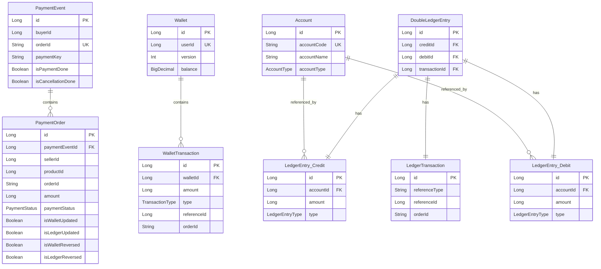

# 도메인 모델 상세 문서

## 목차
1. [Payment Domain](#1-payment-domain)
2. [Wallet Domain](#2-wallet-domain)
3. [Ledger Domain](#3-ledger-domain)
4. [Domain Event](#4-domain-event)
5. [도메인 간 관계](#5-도메인-간-관계)

---

## 1. Payment Domain

### 1.1 PaymentEvent

결제 이벤트의 최상위 애그리게이트 루트입니다. 한 명의 구매자가 여러 판매자의 상품을 구매할 때 생성되며, 전체 결제 프로세스의 생명주기를 관리합니다.

#### 속성

| 속성명 | 타입 | 설명 | 필수 여부 |
|--------|------|------|----------|
| `id` | Long | 엔티티 ID (PK) | Auto Generated |
| `buyerId` | Long | 구매자 ID | 필수 |
| `orderName` | String | 주문명 (상품 정보 요약) | 필수 |
| `orderId` | String | 주문 ID (UUID) | 필수 (유니크) |
| `paymentKey` | String? | Toss 결제 건 ID | PSP 승인 후 설정 |
| `paymentType` | PaymentType? | 결제 타입 (NORMAL, BRANDPAY 등) | PSP 승인 후 설정 |
| `paymentMethod` | PaymentMethod? | 결제 수단 (카드, 계좌이체 등) | PSP 승인 후 설정 |
| `approvedAt` | LocalDateTime? | 승인 시간 | PSP 승인 후 설정 |
| `paymentOrders` | List&lt;PaymentOrder&gt; | 판매자별 주문 리스트 | 필수 (1개 이상) |
| `isPaymentDone` | Boolean | 결제 완료 여부 (Wallet + Ledger) | 내부 상태 (private) |
| `isCancellationDone` | Boolean | 취소 완료 여부 | 내부 상태 (private) |

#### 주요 메서드

```kotlin
data class PaymentEvent(
    val id: Long? = null,
    val buyerId: Long,
    val orderName: String,
    val orderId: String,
    val paymentKey: String? = null,
    val paymentType: PaymentType? = null,
    val paymentMethod: PaymentMethod? = null,
    val approvedAt: LocalDateTime? = null,
    val paymentOrders: List<PaymentOrder> = emptyList()
) {
    private var isPaymentDone: Boolean = false
    private var isCancellationDone: Boolean = false

    /**
     * 전체 결제 금액 계산
     * @return 모든 PaymentOrder의 amount 합계
     */
    fun totalAmount(): Long = paymentOrders.sumOf { it.amount }

    /**
     * 모든 주문이 성공 상태인지 확인
     * @return 모든 PaymentOrder의 paymentStatus가 SUCCESS인 경우 true
     */
    fun isSuccess(): Boolean = paymentOrders.all { it.paymentStatus == PaymentStatus.SUCCESS }

    /**
     * Wallet 업데이트 완료 확인
     * 모든 PaymentOrder의 isWalletUpdated = true 설정
     */
    fun confirmWalletUpdate() {
        paymentOrders.forEach { it.confirmWalletUpdate() }
    }

    /**
     * Ledger 업데이트 완료 확인
     * 모든 PaymentOrder의 isLedgerUpdated = true 설정
     */
    fun confirmLedgerUpdate() {
        paymentOrders.forEach { it.confirmLedgerUpdate() }
    }

    /**
     * 결제 완료 여부 확인 및 플래그 설정
     * Wallet과 Ledger 모두 업데이트 완료 시 isPaymentDone = true
     */
    fun completeIfDone() {
        if (allPaymentOrdersDone()) {
            isPaymentDone = true
        }
    }

    /**
     * Wallet 환불 완료 확인
     */
    fun confirmWalletReversal() {
        paymentOrders.forEach { it.confirmWalletReversal() }
    }

    /**
     * Ledger 역분개 완료 확인
     */
    fun confirmLedgerReversal() {
        paymentOrders.forEach { it.confirmLedgerReversal() }
    }

    /**
     * 취소 완료 여부 확인 및 플래그 설정
     * Wallet과 Ledger 모두 환불/역분개 완료 시 isCancellationDone = true
     */
    fun completeCancellationIfDone() {
        if (allReversalsDone()) {
            isCancellationDone = true
        }
    }

    private fun allPaymentOrdersDone(): Boolean {
        return paymentOrders.all { it.isDone() }
    }

    private fun allReversalsDone(): Boolean {
        return paymentOrders.all { it.isReversalDone() }
    }
}
```

#### 생명주기


---

### 1.2 PaymentOrder

판매자별 주문 정보를 나타냅니다. 하나의 PaymentEvent는 여러 개의 PaymentOrder를 포함할 수 있습니다.

#### 속성

| 속성명 | 타입 | 설명 | 필수 여부 |
|--------|------|------|----------|
| `id` | Long | 엔티티 ID (PK) | Auto Generated |
| `paymentEventId` | Long? | 부모 PaymentEvent ID (FK) | 자동 설정 |
| `sellerId` | Long | 판매자 ID | 필수 |
| `productId` | Long | 상품 ID | 필수 |
| `orderId` | String | 주문 ID (PaymentEvent의 orderId와 동일) | 필수 |
| `amount` | Long | 주문 금액 (원 단위) | 필수 |
| `paymentStatus` | PaymentStatus | 결제 상태 | 필수 |
| `isLedgerUpdated` | Boolean | Ledger 업데이트 완료 여부 | 내부 상태 (private) |
| `isWalletUpdated` | Boolean | Wallet 업데이트 완료 여부 | 내부 상태 (private) |
| `isLedgerReversed` | Boolean | Ledger 역분개 완료 여부 | 내부 상태 (private) |
| `isWalletReversed` | Boolean | Wallet 환불 완료 여부 | 내부 상태 (private) |

#### 주요 메서드

```kotlin
data class PaymentOrder(
    val id: Long? = null,
    val paymentEventId: Long? = null,
    val sellerId: Long,
    val productId: Long,
    val orderId: String,
    val amount: Long,
    val paymentStatus: PaymentStatus
) {
    private var isLedgerUpdated: Boolean = false
    private var isWalletUpdated: Boolean = false
    private var isLedgerReversed: Boolean = false
    private var isWalletReversed: Boolean = false

    /**
     * Wallet 업데이트 완료 표시
     */
    fun confirmWalletUpdate() {
        isWalletUpdated = true
    }

    /**
     * Ledger 업데이트 완료 표시
     */
    fun confirmLedgerUpdate() {
        isLedgerUpdated = true
    }

    /**
     * Wallet 환불 완료 표시
     */
    fun confirmWalletReversal() {
        isWalletReversed = true
    }

    /**
     * Ledger 역분개 완료 표시
     */
    fun confirmLedgerReversal() {
        isLedgerReversed = true
    }

    /**
     * 결제 완료 여부 (Wallet + Ledger 모두 업데이트)
     */
    fun isDone(): Boolean {
        return isWalletUpdated && isLedgerUpdated
    }

    /**
     * 취소 완료 여부 (Wallet + Ledger 모두 환불/역분개)
     */
    fun isReversalDone(): Boolean {
        return isWalletReversed && isLedgerReversed
    }
}
```

---

### 1.3 PaymentStatus

결제 상태를 나타내는 열거형입니다.

```kotlin
enum class PaymentStatus(val description: String) {
    /**
     * 결제 승인 시작 전 (초기 상태)
     */
    NOT_STARTED("결제 승인 시작 전"),

    /**
     * 결제 승인 중 (PSP 호출 중)
     */
    EXECUTING("결제 승인 중"),

    /**
     * 결제 승인 성공 (PSP 승인 완료, Wallet/Ledger 처리 대기)
     */
    SUCCESS("결제 승인 성공"),

    /**
     * 결제 승인 실패 (PSP 승인 실패)
     */
    FAILURE("결제 승인 실패"),

    /**
     * 결제 승인 알 수 없는 상태 (네트워크 오류 등)
     */
    UNKNOWN("결제 승인 알 수 없는 상태"),

    /**
     * 결제 취소됨
     */
    CANCELED("결제 취소됨")
}
```

#### 상태 전이도


---

### 1.4 PaymentType

결제 타입을 나타냅니다.

```kotlin
enum class PaymentType {
    NORMAL,     // 일반 결제
    BILLING,    // 자동 결제 (정기 결제)
    BRANDPAY    // 브랜드페이 (Toss 간편결제)
}
```

---

### 1.5 PaymentMethod

결제 수단을 나타냅니다.

```kotlin
enum class PaymentMethod {
    CARD,               // 신용/체크카드
    VIRTUAL_ACCOUNT,    // 가상계좌
    TRANSFER,           // 계좌이체
    MOBILE_PHONE,       // 휴대폰 결제
    CULTURE_GIFT_CERTIFICATE,  // 문화상품권
    BOOK_GIFT_CERTIFICATE,     // 도서문화상품권
    GAME_GIFT_CERTIFICATE      // 게임문화상품권
}
```

---

## 2. Wallet Domain

### 2.1 Wallet

판매자의 지갑 정보를 나타냅니다. 결제 정산 및 환불 시 잔액이 변경됩니다.

#### 속성

| 속성명 | 타입 | 설명 | 필수 여부 |
|--------|------|------|----------|
| `id` | Long | 엔티티 ID (PK) | Auto Generated |
| `userId` | Long | 판매자 ID (유니크) | 필수 |
| `version` | Int | 버전 (낙관적 잠금용) | 자동 관리 |
| `balance` | BigDecimal | 현재 잔액 (원 단위, 소수점 2자리) | 필수 |
| `walletTransactions` | List&lt;WalletTransaction&gt; | 거래 이력 | 자동 관리 |

#### 주요 메서드

```kotlin
data class Wallet(
    val id: Long,
    val userId: Long,
    @Version val version: Int,  // JPA Optimistic Locking
    val balance: BigDecimal,
    val walletTransactions: List<WalletTransaction> = emptyList()
) {
    /**
     * 정산 처리 (잔액 증가)
     * @param items 정산할 주문 리스트
     * @return 업데이트된 Wallet (불변 객체)
     */
    fun calculateBalanceWith(items: List<Item>): Wallet {
        val totalAmount = items.sumOf { it.amount }
        return copy(
            balance = balance + BigDecimal(totalAmount),
            walletTransactions = items.map {
                WalletTransaction(
                    walletId = this.id,
                    amount = it.amount,
                    type = TransactionType.CREDIT,  // 정산은 CREDIT (증가)
                    referenceId = it.referenceId,
                    referenceType = it.referenceType,
                    orderId = it.orderId
                )
            }
        )
    }

    /**
     * 환불 처리 (잔액 감소)
     * @param items 환불할 주문 리스트
     * @return 업데이트된 Wallet (불변 객체)
     */
    fun calculateBalanceWithRefund(items: List<Item>): Wallet {
        val totalAmount = items.sumOf { it.amount }
        return copy(
            balance = balance - BigDecimal(totalAmount),
            walletTransactions = items.map {
                WalletTransaction(
                    walletId = this.id,
                    amount = it.amount,
                    type = TransactionType.DEBIT,  // 환불은 DEBIT (감소)
                    referenceId = it.referenceId,
                    referenceType = it.referenceType,
                    orderId = it.orderId
                )
            }
        )
    }
}
```

#### 동시성 제어

Wallet은 **낙관적 잠금(Optimistic Locking)**을 사용합니다:

```kotlin
@Entity
@Table(name = "wallets")
data class Wallet(
    @Id val id: Long,
    val userId: Long,
    @Version val version: Int,  // 버전 컬럼
    val balance: BigDecimal
)
```

- 동시에 여러 트랜잭션이 같은 지갑을 업데이트하면:
  1. 먼저 커밋된 트랜잭션이 성공
  2. 나중 트랜잭션은 `OptimisticLockException` 발생
  3. 예외를 캐치하여 재시도

---

### 2.2 WalletTransaction

지갑 거래 이력을 나타냅니다.

#### 속성

| 속성명 | 타입 | 설명 | 필수 여부 |
|--------|------|------|----------|
| `id` | Long | 엔티티 ID (PK) | Auto Generated |
| `walletId` | Long | Wallet ID (FK) | 필수 |
| `amount` | Long | 거래 금액 (원 단위) | 필수 |
| `type` | TransactionType | 거래 타입 (CREDIT/DEBIT) | 필수 |
| `referenceId` | Long | 참조 ID (PaymentOrder ID) | 필수 |
| `referenceType` | String | 참조 타입 (예: "PAYMENT_ORDER") | 필수 |
| `orderId` | String | 주문 ID | 필수 |
| `createdAt` | LocalDateTime | 생성 시간 | 자동 설정 |

#### TransactionType

```kotlin
enum class TransactionType {
    CREDIT,  // 잔액 증가 (정산)
    DEBIT    // 잔액 감소 (환불)
}
```

---

## 3. Ledger Domain

### 3.1 DoubleLedgerEntry

복식 부기 엔트리를 나타냅니다. 하나의 거래는 항상 차변과 대변 쌍으로 기록됩니다.

#### 속성

| 속성명 | 타입 | 설명 | 필수 여부 |
|--------|------|------|----------|
| `id` | Long | 엔티티 ID (PK) | Auto Generated |
| `credit` | LedgerEntry | 대변 항목 | 필수 |
| `debit` | LedgerEntry | 차변 항목 | 필수 |
| `transaction` | LedgerTransaction | 거래 정보 | 필수 |
| `createdAt` | LocalDateTime | 생성 시간 | 자동 설정 |

#### 복식 부기 원칙

```
결제 승인 시:
  차변 (Debit): 매출채권 계정 (자산 증가)
  대변 (Credit): 매출액 계정 (수익 증가)

결제 취소 시 (역분개):
  차변 (Debit): 매출액 계정 (수익 감소)
  대변 (Credit): 매출채권 계정 (자산 감소)
```

---

### 3.2 LedgerEntry

개별 장부 항목(차변 또는 대변)을 나타냅니다.

#### 속성

| 속성명 | 타입 | 설명 | 필수 여부 |
|--------|------|------|----------|
| `id` | Long | 엔티티 ID (PK) | Auto Generated |
| `account` | Account | 계정 정보 | 필수 |
| `amount` | Long | 금액 (원 단위) | 필수 |
| `type` | LedgerEntryType | 항목 타입 (CREDIT/DEBIT) | 필수 |

#### LedgerEntryType

```kotlin
enum class LedgerEntryType {
    CREDIT,  // 대변 (부채/자본/수익 증가, 자산 감소)
    DEBIT    // 차변 (자산/비용 증가, 부채/자본/수익 감소)
}
```

---

### 3.3 Account

계정 정보를 나타냅니다.

#### 속성

| 속성명 | 타입 | 설명 | 필수 여부 |
|--------|------|------|----------|
| `id` | Long | 엔티티 ID (PK) | Auto Generated |
| `accountCode` | String | 계정 코드 (예: "1100") | 필수 (유니크) |
| `accountName` | String | 계정 이름 (예: "매출채권") | 필수 |
| `accountType` | AccountType | 계정 타입 (자산/부채/수익 등) | 필수 |

#### AccountType

```kotlin
enum class AccountType {
    ASSET,      // 자산
    LIABILITY,  // 부채
    EQUITY,     // 자본
    REVENUE,    // 수익
    EXPENSE     // 비용
}
```

#### 주요 계정 예시

| 계정 코드 | 계정명 | 타입 | 설명 |
|----------|--------|------|------|
| `1100` | 매출채권 | ASSET | 판매 대금을 받을 권리 |
| `4100` | 매출액 | REVENUE | 판매로 인한 수익 |

---

### 3.4 LedgerTransaction

장부 거래 정보를 나타냅니다.

#### 속성

| 속성명 | 타입 | 설명 | 필수 여부 |
|--------|------|------|----------|
| `id` | Long | 엔티티 ID (PK) | Auto Generated |
| `referenceType` | String | 참조 타입 (예: "PAYMENT_ORDER") | 필수 |
| `referenceId` | Long | 참조 ID (PaymentOrder ID) | 필수 |
| `orderId` | String | 주문 ID | 필수 |

---

### 3.5 Ledger (Domain Service)

장부 생성 로직을 담당하는 도메인 서비스입니다.

```kotlin
class Ledger {
    companion object {
        /**
         * 결제 승인 시 복식 부기 엔트리 생성
         * @param doubleAccountsForLedger 차변/대변 계정 쌍
         * @param items 주문 리스트
         * @return DoubleLedgerEntry 리스트
         */
        fun createDoubleLedgerEntry(
            doubleAccountsForLedger: DoubleAccountsForLedger,
            items: List<Item>
        ): List<DoubleLedgerEntry> {
            return items.map { item ->
                DoubleLedgerEntry(
                    credit = LedgerEntry(
                        account = doubleAccountsForLedger.to,    // 매출액 계정
                        amount = item.amount,
                        type = LedgerEntryType.CREDIT
                    ),
                    debit = LedgerEntry(
                        account = doubleAccountsForLedger.from,  // 매출채권 계정
                        amount = item.amount,
                        type = LedgerEntryType.DEBIT
                    ),
                    transaction = LedgerTransaction(
                        referenceType = item.type,
                        referenceId = item.id,
                        orderId = item.orderId
                    )
                )
            }
        }

        /**
         * 결제 취소 시 역분개 엔트리 생성 (차변과 대변 반대)
         * @param doubleAccountsForLedger 차변/대변 계정 쌍
         * @param items 주문 리스트
         * @return DoubleLedgerEntry 리스트 (역분개)
         */
        fun createReversalDoubleLedgerEntry(
            doubleAccountsForLedger: DoubleAccountsForLedger,
            items: List<Item>
        ): List<DoubleLedgerEntry> {
            return items.map { item ->
                DoubleLedgerEntry(
                    // 역분개: 차변과 대변 반대
                    credit = LedgerEntry(
                        account = doubleAccountsForLedger.from,  // 매출채권 계정
                        amount = item.amount,
                        type = LedgerEntryType.CREDIT
                    ),
                    debit = LedgerEntry(
                        account = doubleAccountsForLedger.to,    // 매출액 계정
                        amount = item.amount,
                        type = LedgerEntryType.DEBIT
                    ),
                    transaction = LedgerTransaction(
                        referenceType = item.type,
                        referenceId = item.id,
                        orderId = item.orderId
                    )
                )
            }
        }
    }
}
```

#### 복식 부기 시각화


---

## 4. Domain Event

도메인 이벤트는 시스템 내에서 중요한 상태 변화를 나타냅니다. 이벤트 기반 아키텍처의 핵심입니다.

### 4.1 DomainEvent (인터페이스)

모든 도메인 이벤트가 구현해야 하는 인터페이스입니다.

```kotlin
interface DomainEvent {
    val aggregateId: String     // 애그리게이트 ID (orderId)
    val eventId: String          // 이벤트 고유 ID (UUID)
    val occurredAt: LocalDateTime // 이벤트 발생 시간
}
```

---

### 4.2 PaymentConfirmedEvent

결제 승인이 완료되었을 때 발행됩니다.

#### 속성

```kotlin
data class PaymentConfirmedEvent(
    override val aggregateId: String,      // orderId
    override val eventId: String,          // UUID
    override val occurredAt: LocalDateTime,
    val orderId: String,
    val paymentKey: String,
    val buyerId: Long,
    val orderName: String,
    val totalAmount: Long,
    val paymentOrders: List<PaymentOrderInfo>
) : DomainEvent

data class PaymentOrderInfo(
    val id: Long,           // PaymentOrder ID
    val sellerId: Long,
    val amount: Long,
    val orderId: String
)
```

#### 소비자
- `Wallet::PaymentEventListener` → `SettlementService`
- `Ledger::PaymentEventListener` → `DoubleLedgerEntryRecordService`

---

### 4.3 WalletSettledEvent

Wallet 정산이 완료되었을 때 발행됩니다.

#### 속성

```kotlin
data class WalletSettledEvent(
    override val aggregateId: String,      // orderId
    override val eventId: String,          // UUID
    override val occurredAt: LocalDateTime,
    val orderId: String
) : DomainEvent
```

#### 소비자
- `Payment::WalletEventListener` → `PaymentCompleteService`

---

### 4.4 LedgerRecordedEvent

Ledger 기록이 완료되었을 때 발행됩니다.

#### 속성

```kotlin
data class LedgerRecordedEvent(
    override val aggregateId: String,      // orderId
    override val eventId: String,          // UUID
    override val occurredAt: LocalDateTime,
    val orderId: String
) : DomainEvent
```

#### 소비자
- `Payment::LedgerEventListener` → `PaymentCompleteService`

---

### 4.5 PaymentCanceledEvent

결제 취소가 요청되었을 때 발행됩니다.

#### 속성

```kotlin
data class PaymentCanceledEvent(
    override val aggregateId: String,      // orderId
    override val eventId: String,          // UUID
    override val occurredAt: LocalDateTime,
    val orderId: String,
    val paymentKey: String,
    val buyerId: Long,
    val cancelReason: String,
    val cancelAmount: Long,
    val paymentOrders: List<PaymentOrderInfo>
) : DomainEvent
```

#### 소비자
- `Wallet::PaymentEventListener` → `RefundService`
- `Ledger::PaymentEventListener` → `DoubleLedgerReversalRecordService`

---

### 4.6 WalletRefundedEvent

Wallet 환불이 완료되었을 때 발행됩니다.

#### 속성

```kotlin
data class WalletRefundedEvent(
    override val aggregateId: String,      // orderId
    override val eventId: String,          // UUID
    override val occurredAt: LocalDateTime,
    val orderId: String
) : DomainEvent
```

#### 소비자
- `Payment::WalletEventListener` → `PaymentCancellationCompleteService`

---

### 4.7 LedgerReversedEvent

Ledger 역분개가 완료되었을 때 발행됩니다.

#### 속성

```kotlin
data class LedgerReversedEvent(
    override val aggregateId: String,      // orderId
    override val eventId: String,          // UUID
    override val occurredAt: LocalDateTime,
    val orderId: String
) : DomainEvent
```

#### 소비자
- `Payment::LedgerEventListener` → `PaymentCancellationCompleteService`

---

### 4.8 이벤트 흐름도


---

## 5. 도메인 간 관계

### 5.1 애그리게이트 관계도



### 5.2 도메인 경계 (Bounded Context)


### 5.3 의존성 방향


#### 핵심 원칙
1. **단방향 의존성**: 도메인 간 직접 의존 없음, 오직 이벤트를 통한 통신
2. **느슨한 결합**: 각 도메인은 독립적으로 진화 가능
3. **이벤트 소싱**: 모든 상태 변경은 이벤트로 추적
4. **애그리게이트 경계**: PaymentEvent, Wallet, DoubleLedgerEntry는 각각 독립적인 트랜잭션 경계

---

## 6. 도메인 규칙 (Invariants)

### 6.1 Payment Domain 규칙

1. **PaymentEvent는 최소 1개 이상의 PaymentOrder를 포함해야 함**
   ```kotlin
   require(paymentOrders.isNotEmpty()) { "결제는 최소 1개 이상의 주문을 포함해야 합니다." }
   ```

2. **모든 PaymentOrder의 amount는 양수여야 함**
   ```kotlin
   require(amount > 0) { "주문 금액은 0보다 커야 합니다." }
   ```

3. **PaymentEvent의 totalAmount는 모든 PaymentOrder의 amount 합과 일치해야 함**
   ```kotlin
   val calculatedTotal = paymentOrders.sumOf { it.amount }
   require(totalAmount == calculatedTotal) { "총 결제 금액이 일치하지 않습니다." }
   ```

4. **취소는 SUCCESS 상태인 결제만 가능**
   ```kotlin
   require(isSuccess()) { "취소 가능한 상태가 아닙니다." }
   ```

5. **취소는 결제 완료(isPaymentDone = true) 후에만 가능**
   ```kotlin
   require(isPaymentDone) { "결제가 완료되지 않아 취소할 수 없습니다." }
   ```

---

### 6.2 Wallet Domain 규칙

1. **Wallet 잔액은 음수가 될 수 없음**
   ```kotlin
   require(balance >= BigDecimal.ZERO) { "지갑 잔액은 음수가 될 수 없습니다." }
   ```

2. **환불 금액은 현재 잔액을 초과할 수 없음**
   ```kotlin
   val totalRefund = items.sumOf { it.amount }
   require(balance >= BigDecimal(totalRefund)) { "환불 금액이 지갑 잔액을 초과합니다." }
   ```

---

### 6.3 Ledger Domain 규칙

1. **DoubleLedgerEntry의 차변과 대변 금액은 항상 동일해야 함 (복식 부기 원칙)**
   ```kotlin
   require(credit.amount == debit.amount) { "차변과 대변 금액이 일치하지 않습니다." }
   ```

2. **역분개 시 원래 분개와 반대 계정으로 기록**
   ```kotlin
   // 결제 승인: 차변(매출채권), 대변(매출액)
   // 결제 취소: 차변(매출액), 대변(매출채권)
   ```

---

## 7. 주요 파일 경로

### Payment Domain
| 컴포넌트 | 파일 경로 |
|---------|----------|
| PaymentEvent | `monolith/payment-module/src/main/kotlin/com/example/payment/monolith/payment/domain/PaymentEvent.kt` |
| PaymentOrder | `monolith/payment-module/src/main/kotlin/com/example/payment/monolith/payment/domain/PaymentOrder.kt` |
| PaymentStatus | `monolith/payment-module/src/main/kotlin/com/example/payment/monolith/payment/domain/PaymentStatus.kt` |

### Wallet Domain
| 컴포넌트 | 파일 경로 |
|---------|----------|
| Wallet | `monolith/wallet-module/src/main/kotlin/com/example/payment/monolith/wallet/domain/Wallet.kt` |

### Ledger Domain
| 컴포넌트 | 파일 경로 |
|---------|----------|
| Ledger | `monolith/ledger-module/src/main/kotlin/com/example/payment/monolith/ledger/domain/Ledger.kt` |

### Domain Events
| 이벤트 | 파일 경로 |
|--------|----------|
| PaymentConfirmedEvent | `monolith/payment-module/src/main/kotlin/com/example/payment/monolith/payment/domain/event/PaymentConfirmedEvent.kt` |
| PaymentCanceledEvent | `monolith/payment-module/src/main/kotlin/com/example/payment/monolith/payment/domain/event/PaymentCanceledEvent.kt` |
| WalletSettledEvent | `monolith/wallet-module/src/main/kotlin/com/example/payment/monolith/wallet/domain/event/WalletSettledEvent.kt` |
| WalletRefundedEvent | `monolith/wallet-module/src/main/kotlin/com/example/payment/monolith/wallet/domain/event/WalletRefundedEvent.kt` |
| LedgerRecordedEvent | `monolith/ledger-module/src/main/kotlin/com/example/payment/monolith/ledger/domain/event/LedgerRecordedEvent.kt` |
| LedgerReversedEvent | `monolith/ledger-module/src/main/kotlin/com/example/payment/monolith/ledger/domain/event/LedgerReversedEvent.kt` |
